# CSE Technology & Concept Knowledge Graph

## Purpose

This document maps major **Computer Science and Engineering (CSE)** concepts, technologies, tools, frameworks, languages, architectures, and applications as a connected knowledge graph.

**Edge semantics used in the graphs:**

- `parent` — the node is a subfield/subconcept of another node.
- `related` — concepts are strongly associated.
- `implements` — a technology implements a concept/pattern.
- `used-by` — a technology is commonly used by another technology/domain.
- `builds-on` — one concept is foundational to another.
- `alternative` — commonly comparable or interchangeable technologies.

---

# 1. Master CSE Knowledge Graph

```mermaid
graph TD
    CSE[CSE / Computer Science & Engineering]

    CSE --> CS[Computer Science]
    CSE --> CE[Computer Engineering]
    CSE --> SE[Software Engineering]
    CSE --> AI[Artificial Intelligence]
    CSE --> DS[Data Science]
    CSE --> Cyber[Cybersecurity]
    CSE --> Networks[Computer Networks]
    CSE --> Systems[Computer Systems]
    CSE --> Web[Web Technologies]
    CSE --> Mobile[Mobile Computing]
    CSE --> Cloud[Cloud Computing]
    CSE --> DevOps[DevOps / Platform Engineering]
    CSE --> DB[Databases]
    CSE --> Graphics[Computer Graphics]
    CSE --> HCI[Human Computer Interaction]
    CSE --> Theory[Theory of Computation]
    CSE --> Embedded[Embedded Systems]
    CSE --> Blockchain[Blockchain / Distributed Ledger]
    CSE --> IoT[Internet of Things]

    CS --> DSA[Data Structures & Algorithms]
    CS --> OS[Operating Systems]
    CS --> PL[Programming Languages]
    CS --> Compilers[Compiler Design]
    CS --> Architecture[Computer Architecture]
    CS --> Distributed[Distributed Systems]

    AI --> ML[Machine Learning]
    AI --> DL[Deep Learning]
    AI --> NLP[Natural Language Processing]
    AI --> CV[Computer Vision]
    AI --> GenAI[Generative AI]
    AI --> Agents[AI Agents]
    DS --> Statistics[Statistics]
    DS --> DataEngineering[Data Engineering]
    DS --> Visualization[Data Visualization]

    Web --> Frontend[Frontend]
    Web --> Backend[Backend]
    Web --> APIs[APIs]
    Web --> FullStack[Full Stack]

    Cloud --> Compute[Compute]
    Cloud --> Storage[Cloud Storage]
    Cloud --> Serverless[Serverless]
    Cloud --> Containers[Containers]
    Cloud --> Orchestration[Orchestration]

    Cyber --> AppSec[Application Security]
    Cyber --> NetworkSec[Network Security]
    Cyber --> Cryptography[Cryptography]
    Cyber --> Identity[Identity & Access Management]
```

---

# 2. Programming Languages & Paradigms

```mermaid
graph TD
    PL[Programming Languages]

    PL --> Imperative[Imperative]
    PL --> OOP[Object Oriented]
    PL --> Functional[Functional]
    PL --> Declarative[Declarative]
    PL --> Concurrent[Concurrent / Parallel]
    PL --> Scripting[Scripting]
    PL --> Systems[Systems Programming]

    Imperative --> C[C]
    Systems --> CPP[C++]
    Systems --> Rust[Rust]
    Systems --> Zig[Zig]

    OOP --> Java[Java]
    OOP --> CSharp[C#]
    OOP --> CPP
    OOP --> Python[Python]

    Functional --> Haskell[Haskell]
    Functional --> Scala[Scala]
    Functional --> Elixir[Elixir]
    Functional --> Clojure[Clojure]

    Scripting --> Python
    Scripting --> JS[JavaScript]
    Scripting --> Bash[Bash]
    Scripting --> PHP[PHP]
    Scripting --> Ruby[Ruby]

    Declarative --> SQL[SQL]
    Declarative --> HTML[HTML]
    Declarative --> CSS[CSS]

    JS --> TS[TypeScript]
    Java --> Kotlin[Kotlin]
    Java --> Android[Android]
    Swift[Swift] --> iOS[iOS]

    PL --> Memory[Memory Management]
    PL --> Types[Type Systems]
    PL --> Generics[Generics]
    PL --> Concurrency[Concurrency]
    PL --> Exceptions[Exception Handling]
    PL --> Testing[Testing]
```

---

# 3. Data Structures & Algorithms

```mermaid
graph TD
    DSA[Data Structures & Algorithms]

    DSA --> Linear[Linear Structures]
    DSA --> NonLinear[Non-Linear Structures]
    DSA --> Hashing[Hashing]
    DSA --> Sorting[Sorting]
    DSA --> Searching[Searching]
    DSA --> Graphs[Graph Algorithms]
    DSA --> DP[Dynamic Programming]
    DSA --> Greedy[Greedy Algorithms]
    DSA --> Divide[Divide & Conquer]
    DSA --> Complexity[Complexity Analysis]

    Linear --> Array[Array]
    Linear --> LinkedList[Linked List]
    Linear --> Stack[Stack]
    Linear --> Queue[Queue]
    Linear --> Deque[Deque]

    NonLinear --> Tree[Tree]
    NonLinear --> Heap[Heap]
    NonLinear --> Trie[Trie]
    NonLinear --> Graph[Graph]

    Tree --> BST[Binary Search Tree]
    Tree --> AVL[AVL Tree]
    Tree --> Segment[Segment Tree]
    Tree --> BTree[B-Tree]

    Heap --> PriorityQueue[Priority Queue]

    Sorting --> QuickSort[Quick Sort]
    Sorting --> MergeSort[Merge Sort]
    Sorting --> HeapSort[Heap Sort]
    Sorting --> CountingSort[Counting Sort]

    Searching --> BinarySearch[Binary Search]
    Searching --> BFS[Breadth First Search]
    Searching --> DFS[Depth First Search]

    Graphs --> BFS
    Graphs --> DFS
    Graphs --> Dijkstra[Dijkstra]
    Graphs --> Bellman[Bellman-Ford]
    Graphs --> Floyd[Floyd-Warshall]
    Graphs --> MST[Minimum Spanning Tree]

    Complexity --> BigO[Big-O]
    Complexity --> BigOmega[Big-Omega]
    Complexity --> BigTheta[Big-Theta]
```

---

# 4. Operating Systems & Computer Architecture

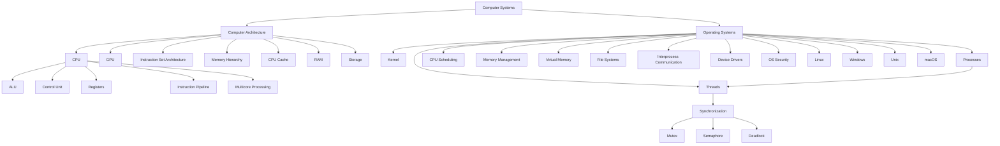

---

# 5. Databases & Data Management

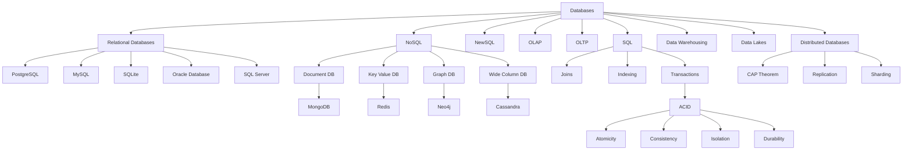

---

# 6. Software Engineering & Development

```mermaid
graph TD
    SE[Software Engineering]

    SE --> SDLC[SDLC]
    SE --> Requirements[Requirements Engineering]
    SE --> Architecture[Software Architecture]
    SE --> DesignPatterns[Design Patterns]
    SE --> Testing[Software Testing]
    SE --> VersionControl[Version Control]
    SE --> CodeQuality[Code Quality]
    SE --> Agile[Agile]
    SE --> ProjectManagement[Project Management]

    VersionControl --> Git[Git]
    Git --> GitHub[GitHub]
    Git --> GitLab[GitLab]
    Git --> Bitbucket[Bitbucket]

    Testing --> Unit[Unit Testing]
    Testing --> Integration[Integration Testing]
    Testing --> System[System Testing]
    Testing --> E2E[End-to-End Testing]
    Testing --> Performance[Performance Testing]
    Testing --> SecurityTesting[Security Testing]

    DesignPatterns --> Singleton[Singleton]
    DesignPatterns --> Factory[Factory]
    DesignPatterns --> Observer[Observer]
    DesignPatterns --> Strategy[Strategy]
    DesignPatterns --> Adapter[Adapter]

    Architecture --> Monolith[Monolith]
    Architecture --> Microservices[Microservices]
    Architecture --> EventDriven[Event Driven]
    Architecture --> Layered[Layered Architecture]
    Architecture --> Hexagonal[Hexagonal Architecture]
```

---

# 7. Web Development

```mermaid
graph TD
    Web[Web Development]

    Web --> Frontend[Frontend]
    Web --> Backend[Backend]
    Web --> FullStack[Full Stack]
    Web --> API[API]
    Web --> Protocols[Web Protocols]

    Frontend --> HTML[HTML]
    Frontend --> CSS[CSS]
    Frontend --> JavaScript[JavaScript]
    Frontend --> TypeScript[TypeScript]

    JavaScript --> React[React]
    JavaScript --> Vue[Vue]
    JavaScript --> Angular[Angular]
    JavaScript --> NextJS[Next.js]
    TypeScript --> NextJS

    CSS --> Tailwind[Tailwind CSS]
    CSS --> Bootstrap[Bootstrap]

    Backend --> Node[Node.js]
    Backend --> Django[Django]
    Backend --> FastAPI[FastAPI]
    Backend --> Spring[Spring Boot]
    Backend --> Express[Express.js]
    Backend --> Laravel[Laravel]

    API --> REST[REST]
    API --> GraphQL[GraphQL]
    API --> GRPC[gRPC]
    API --> WebSockets[WebSockets]

    Protocols --> HTTP[HTTP]
    Protocols --> HTTPS[HTTPS]
    Protocols --> DNS[DNS]
    Protocols --> TLS[TLS]

    FullStack --> MERN[MERN]
    FullStack --> MEAN[MEAN]
    FullStack --> DjangoReact[Django + React]
```

---

# 8. Computer Networks

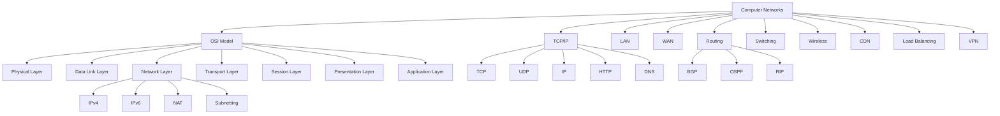

---

# 9. Cloud Computing

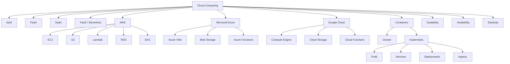

---

# 10. DevOps, CI/CD & Infrastructure

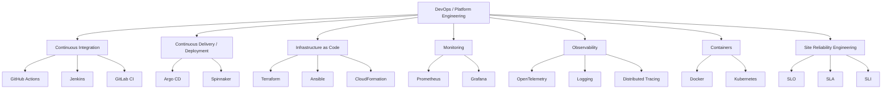

---

# 11. Artificial Intelligence & Machine Learning

```mermaid
graph TD
    AI[Artificial Intelligence]

    AI --> ML[Machine Learning]
    AI --> DL[Deep Learning]
    AI --> NLP[NLP]
    AI --> CV[Computer Vision]
    AI --> RL[Reinforcement Learning]
    AI --> GenAI[Generative AI]

    ML --> Supervised[Supervised Learning]
    ML --> Unsupervised[Unsupervised Learning]
    ML --> SemiSupervised[Semi-Supervised Learning]
    ML --> SelfSupervised[Self-Supervised Learning]

    Supervised --> Regression[Regression]
    Supervised --> Classification[Classification]
    Unsupervised --> Clustering[Clustering]
    Unsupervised --> DimReduction[Dimensionality Reduction]

    ML --> LinearRegression[Linear Regression]
    ML --> LogisticRegression[Logistic Regression]
    ML --> DecisionTree[Decision Trees]
    ML --> RandomForest[Random Forest]
    ML --> SVM[Support Vector Machine]
    ML --> KNN[KNN]
    ML --> XGBoost[XGBoost]

    DL --> NeuralNetworks[Neural Networks]
    NeuralNetworks --> CNN[CNN]
    NeuralNetworks --> RNN[RNN]
    NeuralNetworks --> LSTM[LSTM]
    NeuralNetworks --> Transformer[Transformer]

    ML --> Features[Feature Engineering]
    ML --> Training[Model Training]
    ML --> Evaluation[Model Evaluation]
    Evaluation --> Precision[Precision]
    Evaluation --> Recall[Recall]
    Evaluation --> F1[F1 Score]
    Evaluation --> ROC[ROC-AUC]

    DL --> PyTorch[PyTorch]
    DL --> TensorFlow[TensorFlow]
    DL --> Keras[Keras]
```

---

# 12. Generative AI, LLMs & AI Engineering

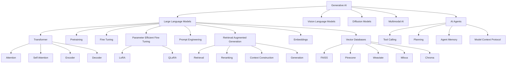

---

# 13. Natural Language Processing

```mermaid
graph TD
    NLP[Natural Language Processing]

    NLP --> TextProcessing[Text Processing]
    NLP --> Linguistics[Linguistics]
    NLP --> InformationRetrieval[Information Retrieval]
    NLP --> LanguageModels[Language Models]

    TextProcessing --> Tokenization[Tokenization]
    TextProcessing --> Stemming[Stemming]
    TextProcessing --> Lemmatization[Lemmatization]
    TextProcessing --> NER[Named Entity Recognition]
    TextProcessing --> POS[Part of Speech Tagging]

    NLP --> Sentiment[Sentiment Analysis]
    NLP --> Classification[Text Classification]
    NLP --> Summarization[Summarization]
    NLP --> Translation[Machine Translation]
    NLP --> QA[Question Answering]
    NLP --> InformationExtraction[Information Extraction]

    LanguageModels --> BERT[BERT]
    LanguageModels --> GPT[GPT]
    LanguageModels --> T5[T5]
    LanguageModels --> LLM

    NLP --> HuggingFace[Hugging Face]
    NLP --> SpaCy[spaCy]
    NLP --> NLTK[NLTK]
```

---

# 14. Computer Vision

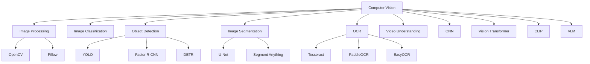

---

# 15. Data Science & Data Engineering

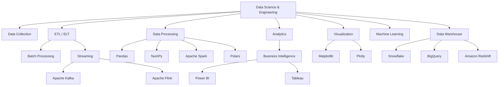

---

# 16. Cybersecurity

```mermaid
graph TD
    Cyber[Cybersecurity]

    Cyber --> CIA[CIA Triad]
    CIA --> Confidentiality[Confidentiality]
    CIA --> Integrity[Integrity]
    CIA --> Availability[Availability]

    Cyber --> Cryptography[Cryptography]
    Cryptography --> Symmetric[Symmetric Encryption]
    Cryptography --> Asymmetric[Asymmetric Encryption]
    Cryptography --> Hashing[Cryptographic Hashing]
    Cryptography --> PKI[Public Key Infrastructure]

    Cyber --> NetworkSecurity[Network Security]
    NetworkSecurity --> Firewall[Firewall]
    NetworkSecurity --> IDS[IDS]
    NetworkSecurity --> IPS[IPS]
    NetworkSecurity --> VPN[VPN]

    Cyber --> ApplicationSecurity[Application Security]
    ApplicationSecurity --> OWASP[OWASP]
    ApplicationSecurity --> SQLInjection[SQL Injection]
    ApplicationSecurity --> XSS[XSS]
    ApplicationSecurity --> CSRF[CSRF]
    ApplicationSecurity --> Auth[Authentication]
    ApplicationSecurity --> Authorization[Authorization]

    Auth --> OAuth[OAuth]
    Auth --> OpenID[OpenID Connect]
    Authorization --> RBAC[RBAC]
    Authorization --> ABAC[ABAC]

    Cyber --> PenTesting[Penetration Testing]
    Cyber --> ThreatModeling[Threat Modeling]
    Cyber --> ZeroTrust[Zero Trust]
```

---

# 17. Distributed Systems

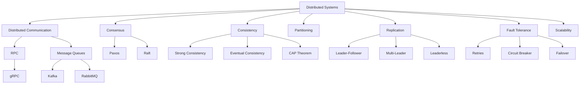

---

# 18. Mobile Development

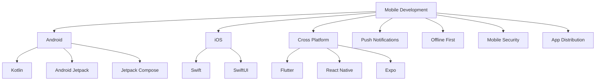

---

# 19. Embedded Systems, IoT & Robotics

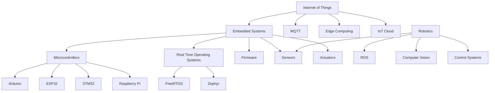

---

# 20. Blockchain & Distributed Ledger

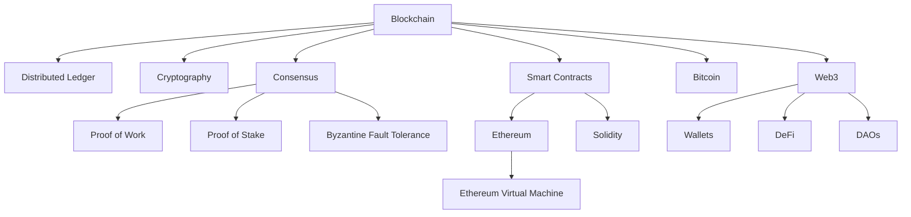

---

# 21. Computer Graphics, HCI & Game Development

```mermaid
graph TD
    Graphics[Computer Graphics]

    Graphics --> Rendering[Rendering]
    Graphics --> Modeling[3D Modeling]
    Graphics --> Animation[Animation]
    Graphics --> Shaders[Shaders]
    Graphics --> GPU[GPU]

    Rendering --> Rasterization[Rasterization]
    Rendering --> RayTracing[Ray Tracing]
    Shaders --> GLSL[GLSL]
    Graphics --> OpenGL[OpenGL]
    Graphics --> Vulkan[Vulkan]
    Graphics --> DirectX[DirectX]

    GameDev[Game Development] --> Unity[Unity]
    GameDev --> Unreal[Unreal Engine]
    GameDev --> Physics[Game Physics]
    GameDev --> GameAI[Game AI]

    HCI[Human Computer Interaction] --> UX[UX]
    HCI --> UI[UI]
    HCI --> Accessibility[Accessibility]
    HCI --> Usability[Usability]
    HCI --> InteractionDesign[Interaction Design]
```

---

# 22. Theory of Computation

```mermaid
graph TD
    Theory[Theory of Computation]

    Theory --> Automata[Automata Theory]
    Theory --> FormalLanguages[Formal Languages]
    Theory --> Computability[Computability]
    Theory --> ComplexityTheory[Complexity Theory]

    Automata --> DFA[DFA]
    Automata --> NFA[NFA]
    Automata --> PDA[Pushdown Automata]
    Automata --> TM[Turing Machine]

    FormalLanguages --> RegularLanguages[Regular Languages]
    FormalLanguages --> CFG[Context Free Grammars]

    Computability --> Decidability[Decidability]
    Computability --> Halting[Halting Problem]

    ComplexityTheory --> P[Class P]
    ComplexityTheory --> NP[Class NP]
    ComplexityTheory --> NPComplete[NP Complete]
    ComplexityTheory --> NPHard[NP Hard]
```

---

# 23. Compilers & Programming Language Implementation

```mermaid
graph TD
    Compiler[Compiler Design]

    Compiler --> Lexical[Lexical Analysis]
    Compiler --> Parsing[Parsing]
    Compiler --> Semantic[Semantic Analysis]
    Compiler --> IR[Intermediate Representation]
    Compiler --> Optimization[Optimization]
    Compiler --> CodeGeneration[Code Generation]

    Lexical --> Lexer[Lexer]
    Parsing --> Parser[Parser]
    Parsing --> CFG[Context Free Grammar]

    Parser --> AST[Abstract Syntax Tree]
    Semantic --> TypeChecking[Type Checking]
    IR --> SSA[Static Single Assignment]
    Optimization --> DeadCode[Dead Code Elimination]
    Optimization --> ConstantFolding[Constant Folding]
    CodeGeneration --> MachineCode[Machine Code]
    CodeGeneration --> Assembly[Assembly]

    Compiler --> LLVM[LLVM]
    Compiler --> GCC[GCC]
```

---

# 24. Common Cross-Domain Relationships

```mermaid
graph LR
    Python --> ML[Machine Learning]
    Python --> DataScience[Data Science]
    Python --> Backend[Backend]
    Python --> Automation[Automation]

    C++ --> Systems[Systems]
    C++ --> GameDev[Game Development]
    C++ --> CompetitiveProgramming[Competitive Programming]

    Java --> Enterprise[Enterprise Software]
    Java --> Android[Android]
    Java --> Backend

    JavaScript --> Frontend[Frontend]
    JavaScript --> Node[Node.js]
    TypeScript --> Frontend
    TypeScript --> Backend

    SQL --> RelationalDB[Relational Databases]
    Docker --> DevOps[DevOps]
    Kubernetes --> Cloud[Cloud]
    Git --> CI[CI/CD]
    Linux --> Cloud
    Linux --> DevOps
    Linux --> Cybersecurity[Cybersecurity]

    TensorFlow --> DeepLearning[Deep Learning]
    PyTorch --> DeepLearning
    HuggingFace --> NLP
    HuggingFace --> LLM[LLMs]

    Kafka --> DistributedSystems[Distributed Systems]
    Kafka --> DataEngineering[Data Engineering]

    REST --> Web
    GraphQL --> Web
    gRPC --> Microservices[Microservices]

    Redis --> Caching[Caching]
    PostgreSQL --> Backend
    MongoDB --> Backend

    AWS --> Cloud
    Azure --> Cloud
    GCP --> Cloud
```

---

# 25. Concept Dependency Graph

This graph shows a **learning dependency relationship**, rather than merely a technology relationship.

```mermaid
graph TD
    Programming[Programming Fundamentals]
    DSA[Data Structures & Algorithms]
    Math[Math & Discrete Mathematics]
    OS[Operating Systems]
    Networks[Computer Networks]
    DB[Databases]
    Architecture[Computer Architecture]

    Programming --> DSA
    Math --> DSA
    Programming --> OS
    Programming --> DB
    Programming --> Networks
    Architecture --> OS

    DSA --> Algorithms[Advanced Algorithms]
    OS --> Distributed[Distributed Systems]
    Networks --> Distributed
    DB --> Distributed

    Programming --> Web[Web Development]
    Networks --> Web
    DB --> Backend[Backend Engineering]
    OS --> Backend

    Math --> ML[Machine Learning]
    DSA --> ML
    Programming --> ML
    ML --> DeepLearning[Deep Learning]
    DeepLearning --> NLP[NLP]
    DeepLearning --> ComputerVision[Computer Vision]
    DeepLearning --> GenAI[Generative AI]

    OS --> Cloud[Cloud Computing]
    Networks --> Cloud
    Distributed --> Cloud
    Web --> Cloud

    Cloud --> DevOps[DevOps]
    DevOps --> Kubernetes[Kubernetes]
    Cloud --> Microservices[Microservices]
    Distributed --> Microservices
```

---

# 26. CSE Technology Stack Map

```mermaid
graph TD
    User[User]
    UI[UI / UX]
    Frontend[Frontend]
    API[API Layer]
    Backend[Backend]
    Cache[Cache]
    DB[Database]
    Queue[Message Queue]
    ML[ML / AI Services]
    Storage[Object Storage]
    Infra[Infrastructure]
    Cloud[Cloud]
    Monitoring[Observability]

    User --> UI
    UI --> Frontend
    Frontend --> API
    API --> Backend

    Backend --> Cache
    Backend --> DB
    Backend --> Queue
    Backend --> ML
    Backend --> Storage

    Queue --> ML
    DB --> ML
    Storage --> ML

    Backend --> Infra
    ML --> Infra
    DB --> Infra
    Queue --> Infra

    Infra --> Cloud
    Cloud --> Monitoring
    Backend --> Monitoring
    ML --> Monitoring
```

---

# 27. Suggested Graph Data Model

To turn this document into an interactive knowledge graph, represent each concept as a node:

```text
Node:
  id
  name
  category
  description
  difficulty
  aliases
  technologies
  prerequisites
  resources

Edge:
  source
  target
  relation
  weight
```

Example:

```text
Python
  category: Programming Language

Python --parent--> Programming Languages
Python --used-by--> Machine Learning
Python --used-by--> Data Science
Python --used-by--> Backend Development
Python --related--> Automation
```

Recommended `relation` values:

```text
parent
child
related
builds-on
prerequisite
implements
used-by
alternative
part-of
specialization-of
depends-on
```

---

# 28. Recommended Top-Level Taxonomy

The complete CSE graph can therefore be organized into these major parent nodes:

1. Programming & Languages
2. Data Structures & Algorithms
3. Discrete Mathematics & Theory
4. Computer Architecture
5. Operating Systems
6. Computer Networks
7. Databases & Data Management
8. Software Engineering
9. Web Development
10. Mobile Development
11. Cloud Computing
12. DevOps & Infrastructure
13. Distributed Systems
14. Artificial Intelligence
15. Machine Learning
16. Deep Learning
17. NLP
18. Computer Vision
19. Generative AI & LLMs
20. Data Science
21. Data Engineering
22. Cybersecurity
23. Cryptography
24. Embedded Systems
25. IoT
26. Robotics
27. Blockchain
28. Computer Graphics
29. Game Development
30. HCI / UX
31. Compilers
32. Parallel & High Performance Computing
33. Quantum Computing
34. Bioinformatics / Computational Biology
35. Information Retrieval
36. Search Systems
37. Software Architecture
38. Testing & Quality Engineering
39. Reliability / SRE
40. AI Engineering / MLOps

---

# 29. Important Note

This is intended as a **CSE knowledge graph**, not simply a list of technologies. In a full implementation, a single node can belong to multiple graphs simultaneously.

For example:

```text
Python
 ├── Programming Language
 ├── Scripting
 ├── Backend Development
 ├── Data Science
 ├── Machine Learning
 ├── AI Engineering
 ├── Automation
 └── DevOps tooling
```

Likewise:

```text
Kubernetes
 ├── Cloud Computing
 ├── Containers
 ├── DevOps
 ├── Distributed Systems
 ├── Microservices
 ├── Networking
 └── Site Reliability Engineering
```

This overlapping structure is intentional: **CSE concepts are highly interconnected rather than mutually exclusive.**
